# 2-bit Baugh-Wooley Signed Multiplier: VLSI Design and Simulation

## Overview

This project presents the design and simulation of a 2-bit Baugh-Wooley signed multiplier, a fundamental component in digital signal processing and arithmetic logic units. The multiplier was developed using a hierarchical VLSI design approach with MAGIC for layout design, NGspice for circuit simulation, and adheres to Design Rule Checks (DRC).

## Key Features

* **2-bit Signed Multiplication:** Implements the Baugh-Wooley algorithm to efficiently multiply two's complement signed numbers.
* **Hierarchical VLSI Design:** Utilizes a bottom-up design approach, starting from basic gates (NAND, AND) and full adders, progressing to complex adder cells (CSA-W, CSA-G), and culminating in the 2-bit multiplier.
* **MAGIC Layout:** All cells and the final multiplier layout were designed using MAGIC, ensuring adherence to VLSI design principles.
* **NGspice Simulation:** Comprehensive simulation of all components and the final multiplier to verify functionality and performance.
* **Design Rule Check (DRC) Clean:** Ensures the layout meets all fabrication requirements.
* **Netlist Extraction:** Ability to extract SPICE-compatible netlists for all designed circuits.
* **Performance Analysis:** Includes critical path analysis and maximum clock frequency determination.

## Design Components

* **Basic Cells:**
    * 1-bit Full Adder (FA): Implemented to perform the addition of three 1-bit binary numbers.
        
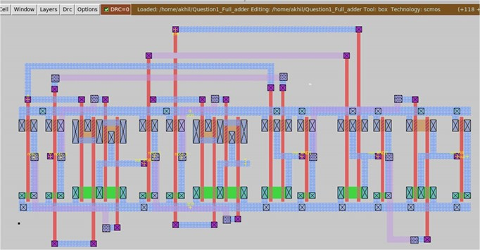

    * 2-input NAND Gate: A fundamental logic gate used in the design.
        
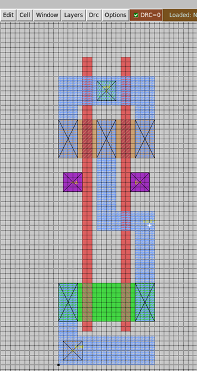

    * 2-input AND Gate: Another essential logic gate used in the design.
        
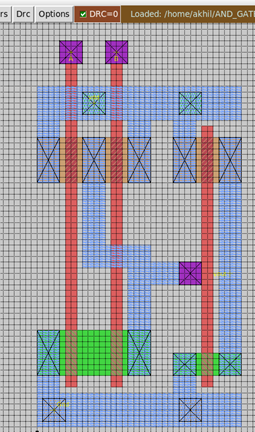

* **Complex Adder Cells:**
    * CSA-W (Carry Save Adder - White): A specific configuration of adder cells for efficient carry propagation.
        
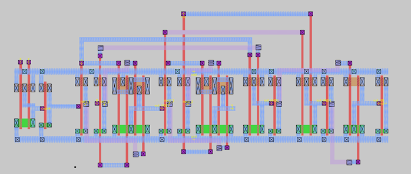

    * CSA-G (Carry Save Adder - Grey): Another configuration of adder cells optimized for performance.
        
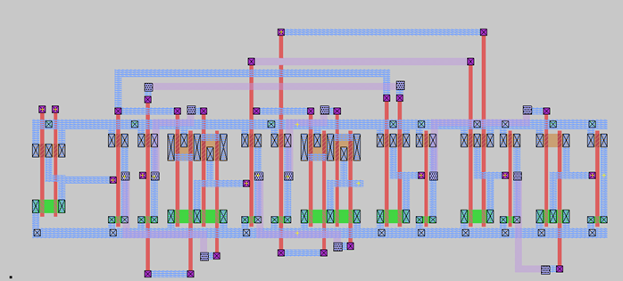

* **2-bit Baugh-Wooley Signed Multiplier:** The final implementation using the hierarchical combination of the above cells and flip-flops.
    
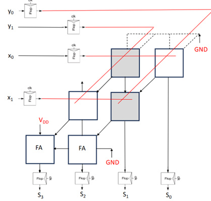

    
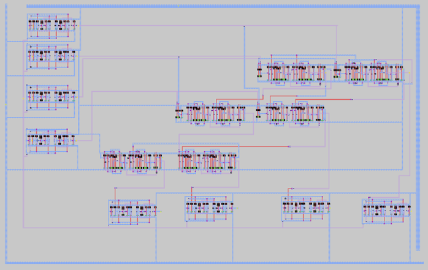

## Simulation Results

* **Functional Verification:** Successful simulation of all components and the 2-bit multiplier, demonstrating correct operation for various input combinations.

* **Simulation Case 1: 1 x -1 = 0011 (-1 in decimal)**
    * Inputs: X1, X0 = 01
    * Inputs: Y1, Y0 = 11 (-1 in decimal)
    * Outputs: S3, S2, S1, S0 = 0011 (-1 in decimal) (S0-white in color and S1-orange) at t=3ns
    
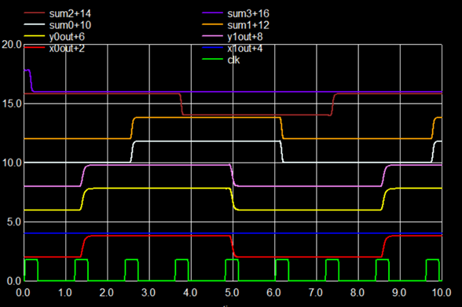

* **Simulation Case 4: -2 x -1 = 0010 (2 in decimal)**
    * Inputs: X1, X0 = 10 (-2 in decimal)
    * Inputs: Y1, Y0 = 11 (-1 in decimal)
    * Outputs: S3, S2, S1, S0 = 0010 (2 in decimal) (S1-orange) at t=3ns
    
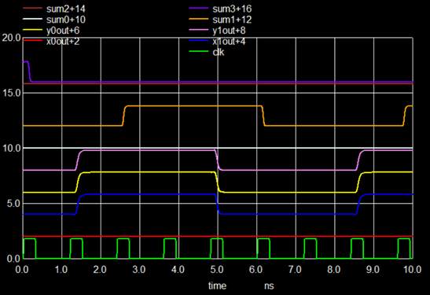

* **Performance Metrics:**
    * Maximum clock frequency: 0.24 GHz, determined through critical path analysis.
        
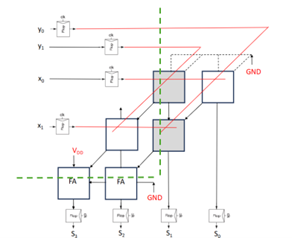

        
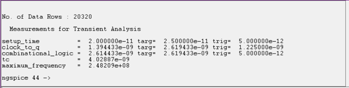

## Usage

1.  **Setup:** Ensure you have MAGIC and NGspice installed.
2.  **Layout Viewing:** Open the layout files in MAGIC to view the designed cells and the 2-bit multiplier.
3.  **Simulation:** Use NGspice to simulate the circuits with the provided testbench files to verify functionality and performance.

## Project Structure

* **magic/**: Contains all MAGIC layout files (.mag).
* **spice/**: Contains all NGspice simulation files (.spice) and simulation results.
* **docs/**: Includes documentation and this README file.

## Acknowledgments

This project was completed as part of the ECE 420 course at the University at Albany.

## Contact

For any questions or further information, please contact akhilreddy1607@gmail.com.
